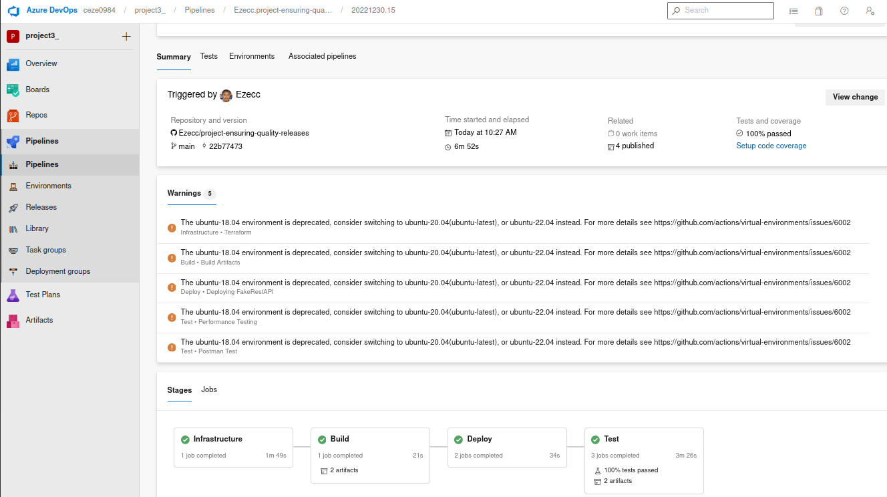

# Ensuring Quality Releases

This is project3 for Udacity Cloud DevOps. It ivolves development of a disposable test environment for a development team by using Microsoft Azure Azure DevOps platform.

The initial starter code for the project is [here](https://github.com/udacity/cd1807-Project-Ensuring-Quality-Releases).

### Tools

1. Visual Studio Code
2. Azure
3. Azure Devops
4. Terraform
5. JMeter
6. Postman
7. Selenium

### Stages:

1. Stage 1 : Infrastructure
2. Stage 2 : Build
3. Stage 3 : Deploy
4. Stage 4 : Test

